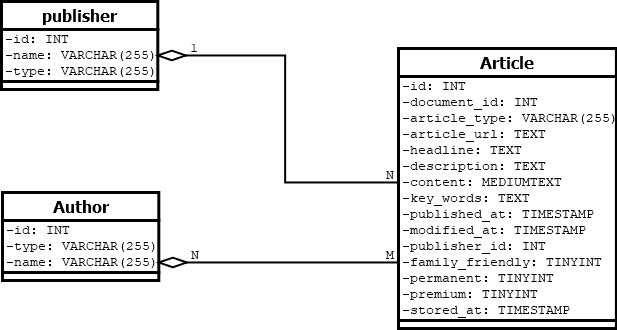
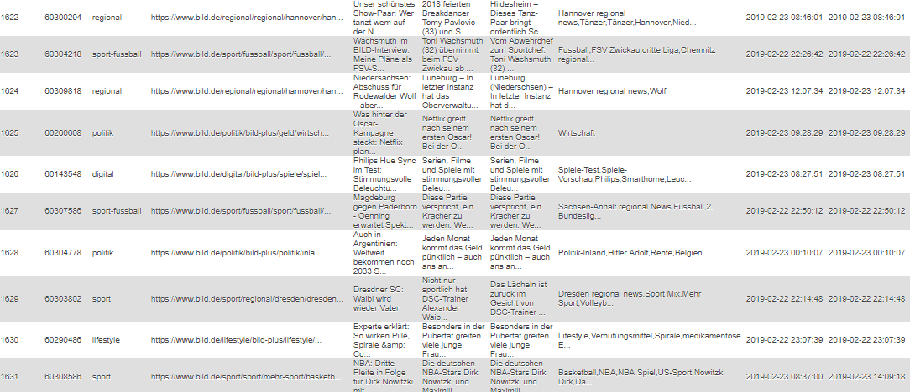
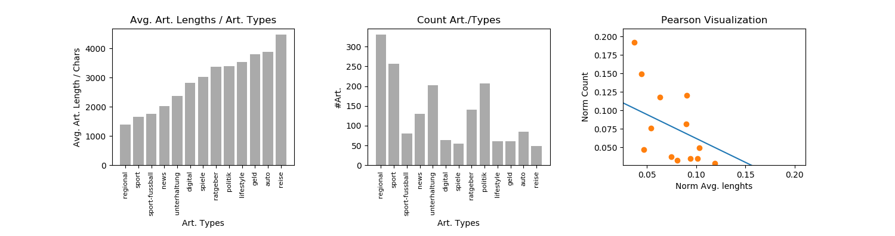

# BILD Mining

Dieses Projekt befasst sich mit der Extraktion und Auswertung von Artikeln, die auf [bild.de](https://www.bild.de) bereitgestellt werden.

## Data Collection Module

Das Skript [miner.py](src/miner.py) kümmert sich um die Extraktion aller aktueller Artikel und deren Speicherung in einer Datenbank. Es werden keine vollständigen HTML-Seiten gespeichert, sondern vorab die relevanten Informationen extrahiert und in normalisierte Tabellen gespeichert. Damit soll der Speicherplatz vorerst geschohnt werden.

### UML der Datenbank

Aufbau der Tabellen innerhalb der DB:

### Code ausführen

* `python mine.py` : Suche neue Artikel und speichere sie in der DB
* `python mine.py -n` : Drop und Create der Tabellen, bevor neue Artikel gespeichert werden. Dieser Befehl muss beim ersten Aufsführen gewählt werden.
* `python mine.py -l` : Speichere nur Artikel mit einer URL, die noch nicht in der DB existiert. Das ist schneller, jedoch werden modifizierte Artikel nicht mehr berücksichtigt.

### Ergebnis
Ein Ausschnitt der Tabelle "Articles":

## Analyze

Das Skript [analyze.py](src/analyze.py) kümmert sich um die Analyze aller extrahierten Daten. Dabei sind hier nur Beispiele gegeben; die Daten können noch weitaus vielfältiger ausgewertet werden.

### Artikellänge und Anzahl

In diesem Beispiel wird analysiert, wie lang Artikel der einzelnen Kategorien durchschnittlich sind und ob es eine Korrelation bezüglich der Gesamtanzahl von Artikeln gibt. 
Resultat:

(Die Statistik bezieht sich auf 1.719 Artikel) Die Korrelation ergibt in diesem Fall -0.6. Damit ist nur eine schwache, negative Korrelation zu erkennen.